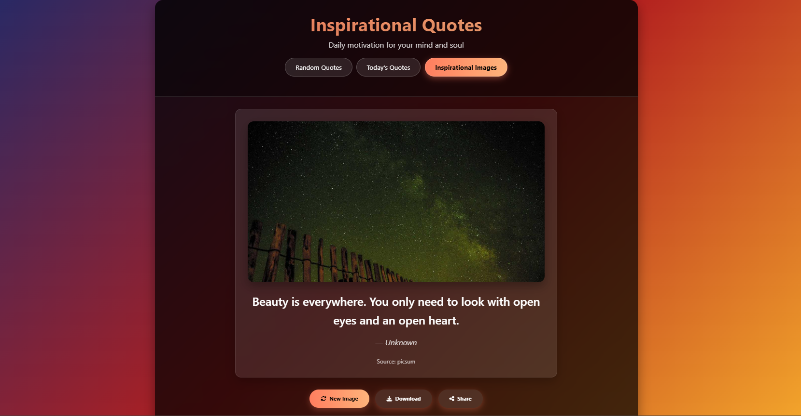

# Inspirational Quotes Web App

A beautiful, responsive web application that delivers daily inspiration through quotes and images. This app features a modern glassmorphism UI with smooth animations and transitions.

## Features

- **Random Quotes**: Fetch inspirational quotes from multiple APIs
- **Today's Quotes**: Get specially curated quotes for the current day
- **Inspirational Images**: Beautiful nature images to complement the quotes
- **Responsive Design**: Works perfectly on desktop, tablet, and mobile devices
- **Modern UI**: Glassmorphism design with smooth animations
- **Share Functionality**: Share quotes with friends via social media or copy to clipboard
- **Download Images**: Save inspirational images to your device

## APIs Used

- [ZenQuotes](https://zenquotes.io/) - For random and today's quotes
- [Quotable](https://api.quotable.io/) - Alternative quote source
- [Picsum](https://picsum.photos/) - For random nature images
- [Unsplash](https://source.unsplash.com/) - Alternative image source

## Installation

No installation required! Simply open `index.html` in a modern web browser.

Alternatively, you can deploy this to GitHub Pages:

1. Fork this repository
2. Go to Settings > Pages
3. Select the main branch as the source
4. Your app will be live at `https://[your-username].github.io/[repository-name]`

## Usage

1. Open the web application
2. Choose between:
   - **Random Quotes**: Get a random inspirational quote
   - **Today's Quotes**: View today's special quote
   - **Inspirational Images**: See a beautiful image with an inspirational message
3. Use the buttons to:
   - Get new content
   - Share quotes with others
   - Copy quotes to clipboard
   - Download images

## Browser Support

This app works best in modern browsers that support:
- ES6+ JavaScript features
- CSS3 animations and gradients
- Flexbox and Grid layout
- Web Share API (for sharing functionality)

## Contributing

Contributions are welcome! Please feel free to submit a Pull Request.

1. Fork the project
2. Create your feature branch (`git checkout -b feature/AmazingFeature`)
3. Commit your changes (`git commit -m 'Add some AmazingFeature'`)
4. Push to the branch (`git push origin feature/AmazingFeature`)
5. Open a Pull Request

## License

This project is licensed under the MIT License - see the [LICENSE](LICENSE) file for details.

## Acknowledgments

- Thanks to ZenQuotes and Quotable for providing free quote APIs
- Thanks to Picsum and Unsplash for providing beautiful random images
- Icons by [Font Awesome](https://fontawesome.com/)
- Glassmorphism UI inspiration from modern design trends
